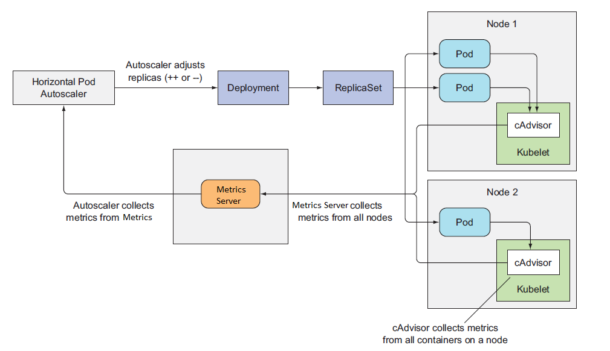

# Horizontal Scaling

## HPA Architecture

## Manual Scaling

In order to test how your application responds to the resource availability changes in your AKS cluster, you can manually scale pods (replicas). By manually scaling these resources, you can define a set number of resources in your cluster. In order to manually scale, first you define the pod or node count, and then the Kubernetes API schedules the creation of additional pods or node draining depending on the pod or node count.

## Auto Scaling

A Kubernetes cluster need a way to automatically scale pods or nodes in order to adjust to the varying application demands, depending on the traffic received by an application. Kubernetes clusters can scale deployments/pods/containers in two ways:

1. The horizontal pod autoscaler (HPA): This leverages the Metrics Server in a Kubernetes cluster to monitor the resource demand of pods. In case if an application requests for more resources, the number of replicas is automatically increased to meet that demand.

2.  The vertical pod autoscaler (VPA). VPA automatically sets the resource request and limit values of containers based on usage. VPA aims to reduce the maintenance overhead of configuring resource requests and limits for containers and improve the utilization of cluster resources.

> Note: Vertical Pod Autoscaling is a new feature that is yet part of AKS.  However, it can be installed manually.

### Scale Event Timing Considerations

Previous scale events in an AKS cluster may not have been successfully completed between Metrics API checks that happen every 30 seconds. This phenomenon could potentially cause the HPA to change the number of pods before the previous scale event can grasp the application workload and adjust to the resource demands accordingly. To minimize such race events, cooldown or delay values are set in an AKS cluster. These values depict how long the HPA must wait after a scale event before another scale event can be triggered. By doing so, it will allow the new pod count to take effect and the Metrics API to reflect the newly distributed workload. 

Default setttings for sync metrics, upscaling, and downscaling:

    Check Metrics Server (horizontal-pod-autoscaler-sync-period) -> 30 sec

    Scale Up Events (horizontal-pod-autoscaler-upscale-delay) -> 3 minutes

    Scale Down Events (horizontal-pod-autoscaler-downscale-delay) -> 5 ninutes

## Autoscaling API Versions

> There are differences in what scaling features are supported based upon the Autoscaling API version that is used.

**autoscaling/v1** ==> Scaling on CPU only!

**autoscaling/v2beta** ==> Includes support support for scaling on memory and custom metrics

## Resource Management Best Practices

* Utilize pod anti-affinity to spread workloads across multiple availability zones to ensure high availability for your application.

* If you’re using specialized hardware, such as GPU-enabled nodes, ensure that only workloads that need GPUs are scheduled to those nodes by utilizing taints.

* Use NodeCondition taints to proactively avoid failing or degraded nodes.

* Apply nodeSelectors to your pod specifications to schedule pods to specialized hardware that you have deployed in the cluster.

* Before going to production, experiment with different node sizes to find a good mix of cost and performance for node types.

* If you’re deploying a mix of workloads with different performance characteristics, utilize node pools to have mixed node types in a single cluster.

* Ensure that you set memory and CPU limits for all pods deployed to your cluster.

* Utilize ResourceQuotas to ensure that multiple teams or applications are alotted their fair share of resources in the cluster.

* Implement LimitRange to set default limits and requests for pod specifications that don’t set limits or requests.

* Start with manual cluster scaling until you understand your workload profiles on Kubernetes. You can use autoscaling, but it comes with additional considerations around node spin-up time and cluster scale down.

* Use the HPA for workloads that are variable and that have unexpected spikes in their usage.

## Resources

* [Kubernetes Best Practices](https://www.oreilly.com/library/view/kubernetes-best-practices/9781492056461/)

## Links

* [Kubernetes HPA Documentation](https://kubernetes.io/docs/tasks/run-application/horizontal-pod-autoscale/)
* [Autoscaling Design Proposal](https://github.com/kubernetes/community/blob/master/contributors/design-proposals/autoscaling/horizontal-pod-autoscaler.md?source=post_page#autoscaling-algorithm)
* [Autoscaling 101](https://levelup.gitconnected.com/kubernetes-autoscaling-101-cluster-autoscaler-horizontal-pod-autoscaler-and-vertical-pod-2a441d9ad231)
* [Best Practices for Autoscaling](https://www.replex.io/blog/kubernetes-in-production-best-practices-for-cluster-autoscaler-hpa-and-vpa)
* [AKS Scaling Tutorial](https://docs.microsoft.com/en-au/azure/aks/tutorial-kubernetes-scale)

## 
Next: [Horizontal Scaling - CPU Lab](06-horizontal-scaling-cpu-lab.md)